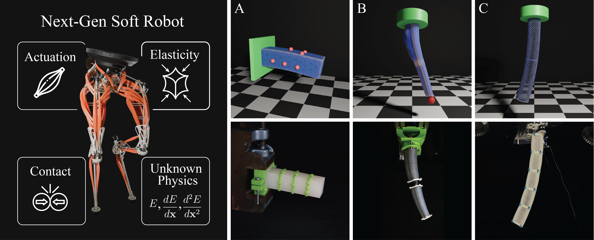
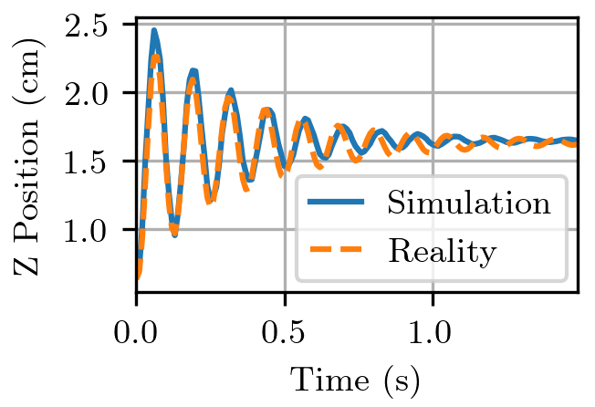
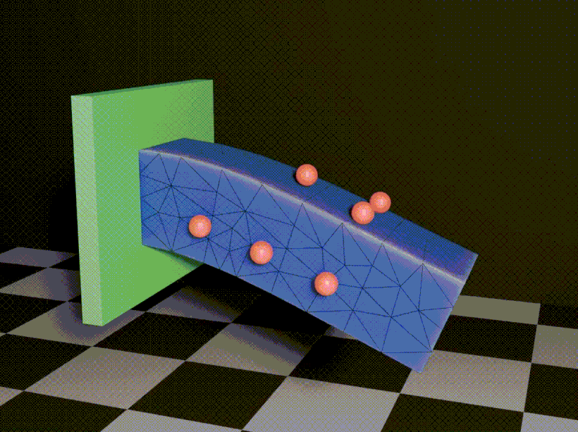
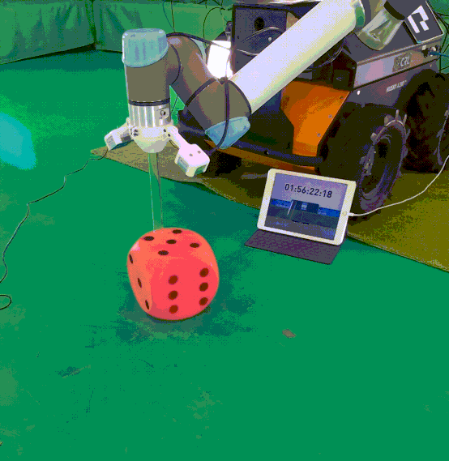
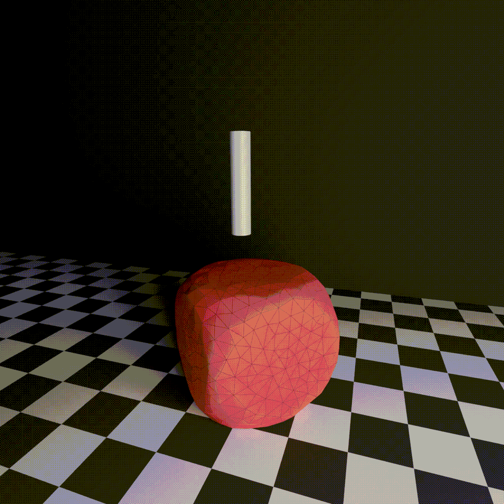
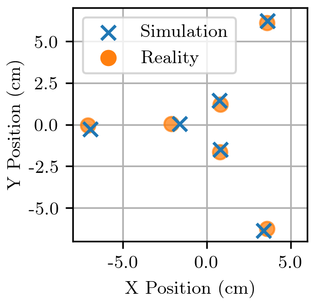
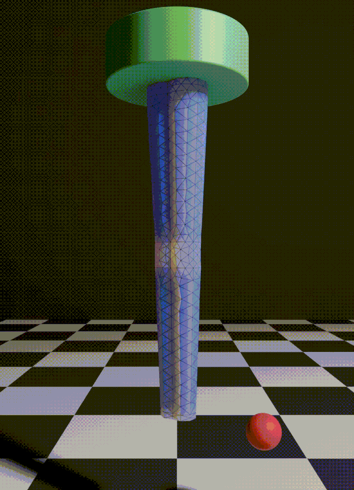
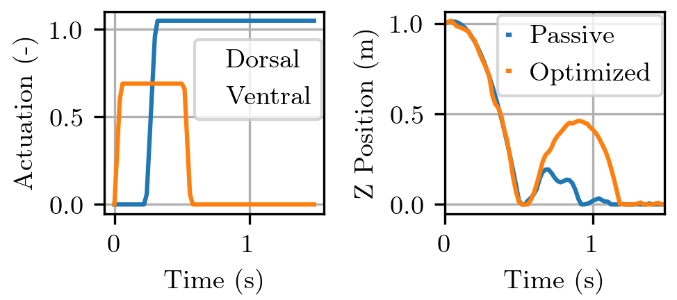
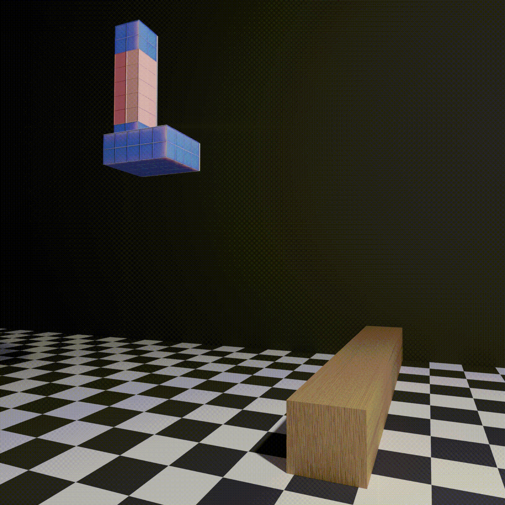
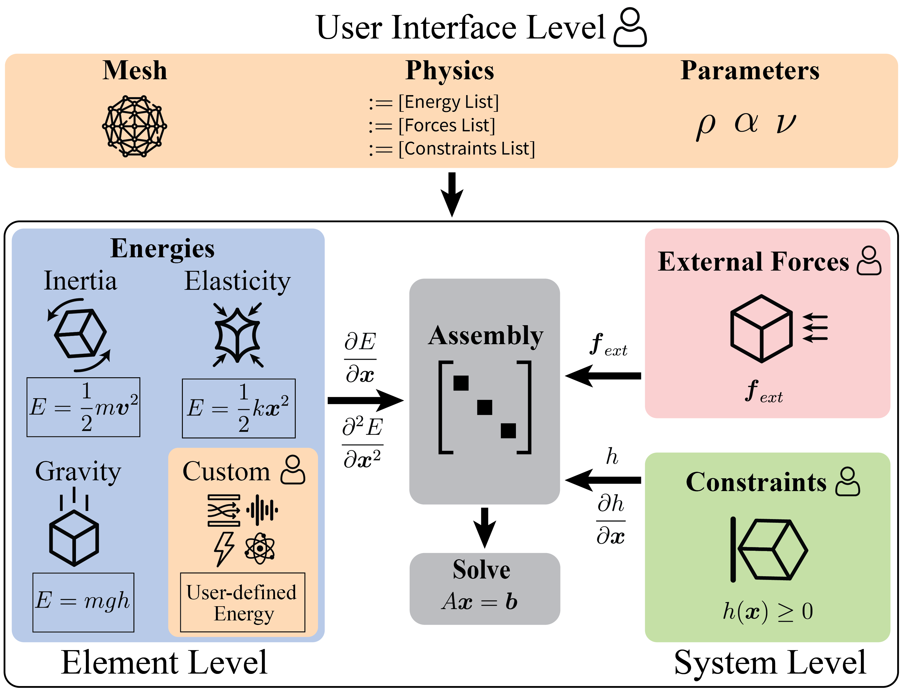

# SORS Simulation Framework

This repository contains the simulation framework **SORS (Soft Over Rigid Simulator)**, referring to the paper:  
SORS: A Modular, High-Fidelity Simulator for Soft Robots (Arxiv link)

<p align="center">

</p>

SORS is a high-fidelity, energy-based simulation framework for soft robots that accurately captures nonlinear deformations, complex material behavior, and contact interactions. Built on the finite element method, SORS is designed to be modular and extensible, enabling custom material and actuation models. By bridging the sim-to-real gap, SORS provides a validated tool for prototyping, control, and analysis of next-generation soft robotic systems.


## Installation

For Linux distributions, tested on Ubuntu 22.04, we need the following packages installed:
```
sudo apt-get install imagemagick ffmpeg
```

Once these are installed, the simulator can be set up using:
```
git clone --recursive git@github.com:srl-ethz/sors.git
cd sors
conda env create -f python/environment.yml
conda activate sors
./install.sh
```

Alternatively, if you only need to interface with the Python front-end, use `pip install -e . -v` instead of `./install.sh`. After making changes, you can rebuild and run the C++ entry point using:
```
./compile.sh;./cpp/build/sors
```

SORS produces simulation outputs in VTU/PVD format, which can be visualized using standard scientific and graphics tools such as ParaView or Blender, enabling inspection of deformations, stresses, and contact interactions.

## Paper Examples

For each of the paper figures, we detail below how to reproduce the reported results. Some examples require additional datasets, which must be downloaded separately. The corresponding download links and instructions are provided in the `README.md` files inside the respective subfolders of `data/`.

### Cantilever: Soft Deformation Benchmark

To generate the CSVs containing the displacements of the cantilever, run
```
python python/d02a_cantilever_sim2real.py
```
These outputs will by default be in `output/cantilever/plots`. The optimized parameters are used by default, but the user can optimize these from scratch by running `python python/d02b_cantilever_opt.py` and connecting to Weights and Biases.

Once the CSVs are generated, we plot the figures using 
```
python python/plotting/plot_cantilever.py
```
which puts the corresponding plot from the paper into `output/cantilever/plots`. This will result in the oscillation seen in Figure 3 of the paper.

<p align="center">


</p>


### PokeFlex: Contact-Rich Soft Body Interaction Benchmark

We provide three Python entry points for running the PokeFlex soft-body poking simulation in SORS, evaluating sim-to-real performance against reconstructed meshes, and performing hyperparameter optimization with Weights and Biases.

1.  Single demo rollout
    ```
    python python/d03_pokeflex.py
    ```
    Runs a short poking simulation with a disk-shaped end-effector on a tetrahedral mesh (foam dice), with optional VTU/PVD export and PBRT rendering.

2.  Sim-to-real evaluation (batch or single)
    ```
    python python/d03a_pokeflex_sim2real.py
    ```
    Replays real robot pokes (tool motion) from the PokeFlex dataset, simulates the deformation, and evaluates per-frame error versus reconstructed surface meshes. Configuration parameters are loaded from `configs/config_pokeflex_sim2real.yml`. Supports running a single (trial, poke) sequence or all sequences listed in the YAML (mode: single / mode: all). The optimized parameters are used by default, but the user can optimize these from scratch by running `python python/d03b_pokeflex_opt.py`.

3.  Hyperparameter optimization
    ```
    python python/d03b_pokeflex_opt.py
    ```
    Runs Bayesian optimization over simulation parameters to minimize sim-to-real error (mean Chamfer distance across sequences). Loads base sim-to-real configuration `configs/config_pokeflex_sim2real.yml` and additionally reads sweep definition from `configs/config_pokeflex_opt.yml`. 

<p align="center">


</p>

### Soft Arm: Pressure-Actuated Continuum Robot

To generate the CSVs containing the quasistatic poses of the pressure-actuated soft arm, run
```
python python/d04a_sopra_quasistatic.py
```
These outputs will by default be in `output/sopra/plots`. The optimized parameters are used by default, but the user can optimize these from scratch by running `python python/d04b_sopra_opt.py` and connecting to Weights and Biases.

Once the CSVs are generated, we plot the figures using 
```
python python/plotting/plot_sopra.py
```
which puts the corresponding plot from the paper into `output/sopra/plots`. This will result in the sim-to-real matching seen in Figure 5 of the paper.

<p align="center">


</p>

### Muscle-Actuated Leg: Optimal Control of Bio-Inspired Locomotion

To generate the CSVs containing the trajectories of the unactuated and optimized hopping leg, run
```
python python/d05_hopping_leg.py
``` 
These outputs will by default be in `output/hopping_leg_unactuated/plots` and `output/hopping_leg/plots` respectively. The user can optimize the optimal control from scratch by running `python python/d05b_hopping_leg_opt.py` and connecting to Weights and Biases.

Once the CSVs are generated, we plot the figures using 
```
python python/plotting/plot_leg.py
```
which puts the corresponding plot from the paper into `output/hopping_leg/plots`. This will result in the optimized jumping example seen in Figure 6 of the paper.

<p align="center">


</p>

### Other Examples

Additional demo examples are available in `cpp/demos/` and can be run via the C++ entry point
(`main.cpp`). These include:

- Generic soft-body deformation
- Soft contact with rigid primitives (planes, disks)
- Muscle actuation 
- Multibody and constraint-driven setups

These demos are intended for development, testing, and showcasing individual features of SORS.

## Framework Architecture and Extending SORS

SORS is built around three modular interfaces — energies, forces, and constraints — which together define the physical behavior of a soft robotic system. Element-wise energy terms are evaluated locally and assembled into global system matrices, while forces and constraints operate at the system level, enabling extensibility and physical consistency.

<p align="center">

</p>

SORS is designed to be modular. New physical components can be added as follows:

### Add a new energy
- Implement a new class deriving from `ElementEnergy`, define energy function, gradient and Hessian.
- Add the header of the new energy to the include list in `element.h`.
- Add the new energy to the constructor of `Tetrahedron` and `Hexahedron`.
- When running a demo, add the new energy to `elementEnergiesList` and its corresponding parameters to `elementParameterList`.

### Add a new constraint
- Implement a new class deriving from `Constraint`, define constraint value and Jacobian.
- Add the header of the new constraint to the include list in `energy.h`.
- Add the new constraint to the constructor of `Energy`.
- When running a demo, add the new constraint to `constraintTypesList` and its corresponding parameters to `constraintParameterList`.

### Add a new external force
- Implement a class deriving from `ExternalForce`, define force and force gradient.
- Add the header of the new force to the include list in `energy.h`.
- Add the new force to the constructor of `Energy`.
- When running a demo, add the new force to `forceTypesList` and its corresponding parameters to `forceParameterList`.

Refer to existing implementations (e.g. Neo-Hookean energy, PlaneContact) as minimal templates.

## Known Limitations

- Contact is currently frictionless (no rolling or tangential friction).
- GPU acceleration is not yet supported; simulation runs on CPU (OpenMP).
- Contact handling primarily supports rigid primitives (planes, disks); general mesh–mesh contact is limited.
- No self-collision handling for soft bodies.
- Meshes are assumed to be clean and well-conditioned (no automatic repair or remeshing).
